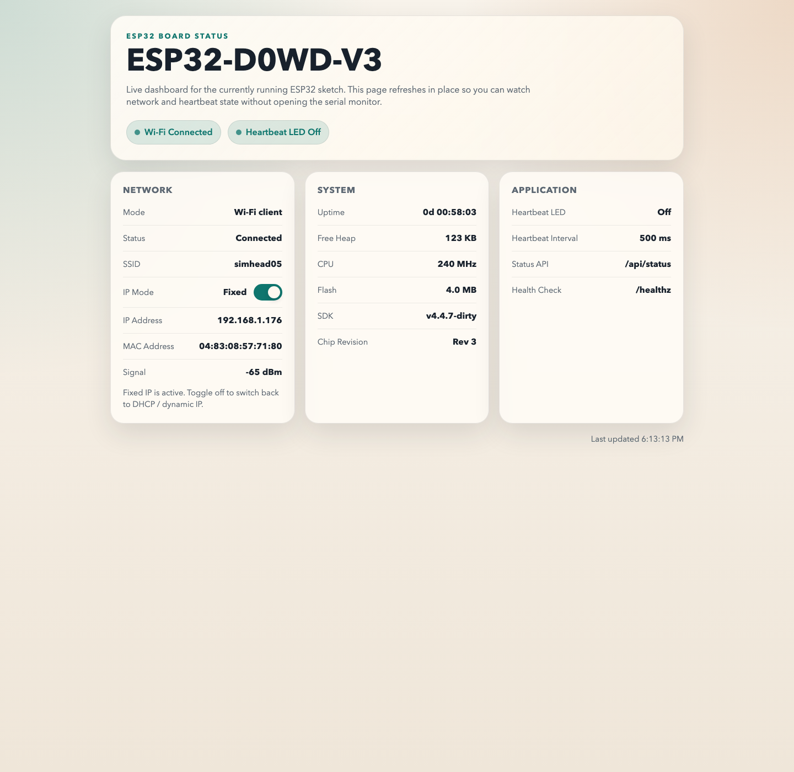
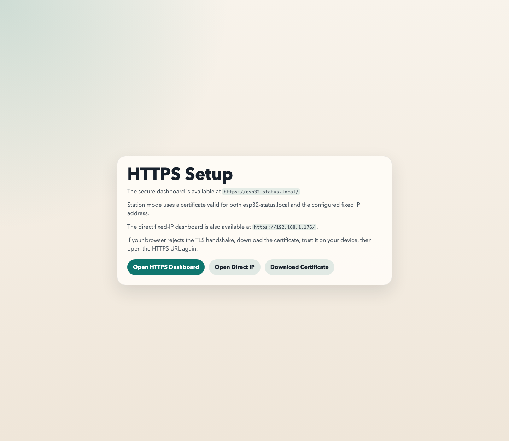

# ESP32 Arduino Project

Professional ESP32 starter project using the Arduino framework and a modular C++ layout.

## Features

- Serial initialization at `115200`
- Wi-Fi connection helper with build-time environment-variable secrets
- Non-blocking heartbeat LED using `millis()`
- I2C OLED status display support for a 4-pin screen
- OLED header icons plus Wi-Fi-synced time and date
- Built-in HTTPS status dashboard on `/`
- JSON status endpoint on `/api/status`
- Self-signed TLS certificate for local development
- HTTP port 80 bootstrap page for HTTPS onboarding
- Fixed station IP support for the normal Wi-Fi network
- Fallback access point if Wi-Fi connection fails
- Separated application, connectivity, and heartbeat modules

## Structure

- `platformio.ini`: PlatformIO project configuration
- `include/AppConfig.h`: connectivity and timing constants
- `include/Connectivity.h`: Wi-Fi interface
- `include/Heartbeat.h`: heartbeat LED interface
- `include/StatusDisplay.h`: local OLED status display interface
- `include/StatusServer.h`: HTTP dashboard interface
- `include/generated/*.h`: locally generated embedded certificate/key headers
- `include/Application.h`: setup and loop orchestration
- `certs/`: local self-signed certificate and key
- `docs/`: reference screenshots for the browser UI
- `.env.example`: sample local environment-variable file for Wi-Fi secrets
- `scripts/load_build_secrets.py`: loads selected PlatformIO build settings from shell environment variables
- `scripts/generate_self_signed_cert.sh`: regenerates the local TLS assets
- `src/*.cpp`: implementation files

## Getting Started

1. Create a local `.env.local` file based on `.env.example` and set your Wi-Fi values there.
2. Export the variables into your shell with `set -a && source .env.local && set +a`.
3. Adjust the timezone or NTP servers in `include/AppConfig.h` if you want the OLED time/date to use a different locale.
4. Generate local TLS assets with `./scripts/generate_self_signed_cert.sh`.
5. Build the project with `pio run`.
6. Flash the board with `pio run --target upload`.
7. Open the serial monitor with `pio device monitor`.
8. Open the printed HTTPS dashboard URL in a browser to view live board status.

## OLED Wiring

This firmware assumes a common 4-pin I2C OLED, typically an `SSD1306` `128x64` module.

- Display `GND` -> ESP32 `GND`
- Display `VDD` -> ESP32 `3V3`
- Display `SCK` -> ESP32 `GPIO22` (I2C clock / `SCL`)
- Display `SDA` -> ESP32 `GPIO21` (I2C data / `SDA`)

Notes:
- On many small OLEDs, the pin labeled `SCK` really means the I2C clock line, not SPI.
- The ESP32 GPIOs are `3.3V`, so `3V3` is the safe default supply unless your module documentation explicitly says otherwise.
- The code scans the common OLED I2C addresses `0x3C` and `0x3D`.
- If the screen stays blank, the module may use a different controller such as `SH1106`; this implementation currently defaults to `SSD1306`.

## Wi-Fi Fallback

If the ESP32 cannot join your normal Wi-Fi at boot, it now:

- Waits briefly for power to stabilize before bringing up Wi-Fi
- Starts a fallback access point immediately
- Shows the fallback SSID on the OLED
- Keeps retrying your configured Wi-Fi in the background every few seconds
- Turns the fallback AP back off after station Wi-Fi has been healthy for a short time

If you see `192.168.4.1`, you must first join the fallback SSID shown on the display or serial log before that address will be reachable from your phone or laptop.

## Fixed Station IP

The normal Wi-Fi client interface can now use a fixed IP address instead of DHCP.

- Static-IP settings live in `include/AppConfig.h`
- Set `kUseStaticStationIp` to `true` for a fixed IP or `false` for DHCP / dynamic IP
- The current defaults are `192.168.1.176` with gateway `192.168.1.1`
- Fallback AP mode still uses `192.168.4.1`
- The dashboard API and OLED now show whether the board is using `Fixed`, `Dynamic`, or `AP local`
- The HTTPS dashboard now includes a toggle switch that saves the chosen mode and reconnects Wi-Fi to apply it

Choose a fixed IP that is free on your LAN or reserved for the ESP32 in your router, otherwise you may hit an IP conflict.

## HTTPS Dashboard

- `/`: live board status dashboard over HTTPS
- `/api/status`: machine-readable JSON status
- `/healthz`: simple text health check

## Browser UI Preview

These screenshots were captured from a live ESP32 board responding at the fixed IP `192.168.1.176`. Your SSID, IP address, uptime, and signal values will vary.

### HTTPS dashboard

Main live status page served over HTTPS:

### HTTP setup page

Bootstrap page served on port `80` to help users reach the HTTPS dashboard and download the certificate:

The firmware serves on port `443` with a project-local self-signed certificate. Browsers will warn until you trust `certs/status-server-cert.pem`.

When the ESP32 joins your normal Wi-Fi network, the preferred URL is `https://esp32-status.local/`.

If the board cannot join the configured Wi-Fi network, it automatically starts a fallback access point using the `kFallbackApSsidPrefix` and `kFallbackApPassword` values in `include/AppConfig.h`. In that mode, use `https://192.168.4.1/`.

If you open `http://` or only the bare IP address, port `80` now serves a bootstrap page. It links to the HTTPS dashboard, shows the preferred hostname and direct fixed-IP option when available, and lets you download the certificate at `/cert.pem`.

In fixed-IP station mode, the certificate matches both `esp32-status.local` and the configured fixed IP address. In dynamic-IP station mode, use `esp32-status.local` because the certificate does not follow a DHCP-assigned IP.

The private key is stored in `certs/status-server-key.pem` for development convenience. The local `.env` files, generated certificate PEM files, and generated key headers are now git-ignored so they do not get added to a future GitHub repo by default.
